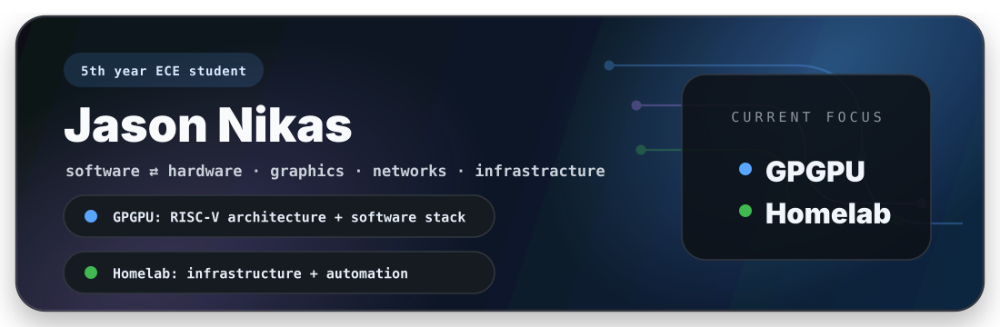
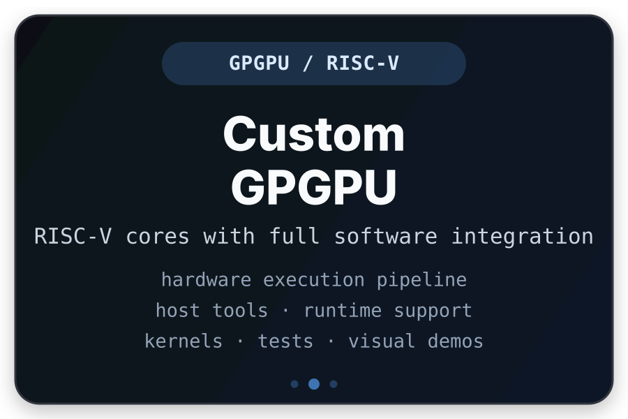
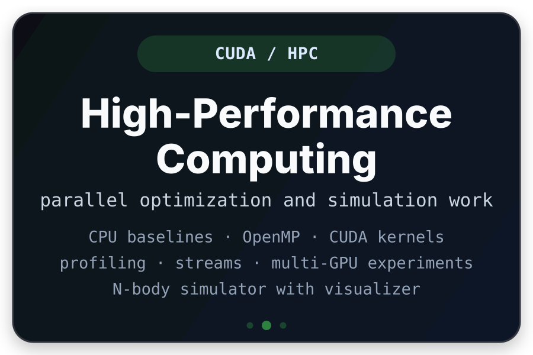
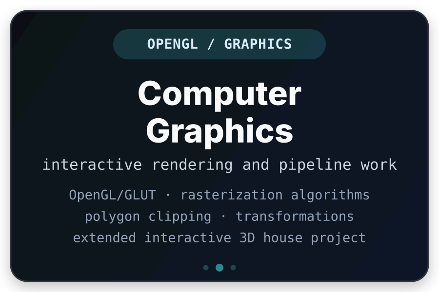
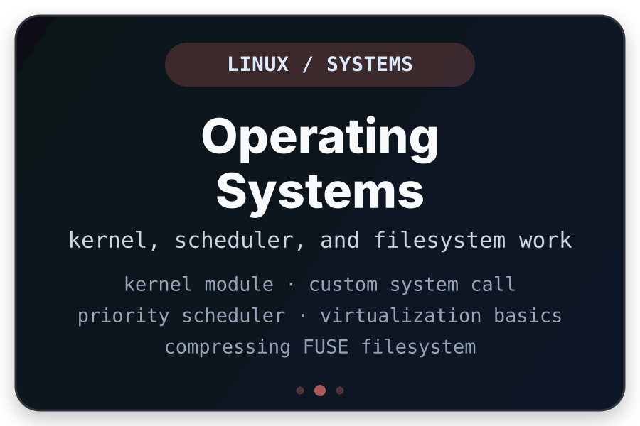
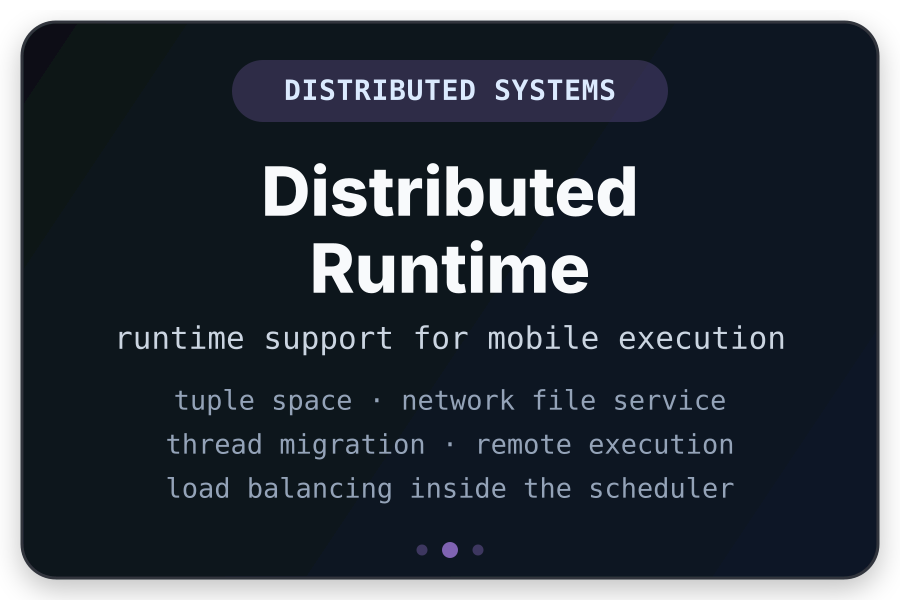
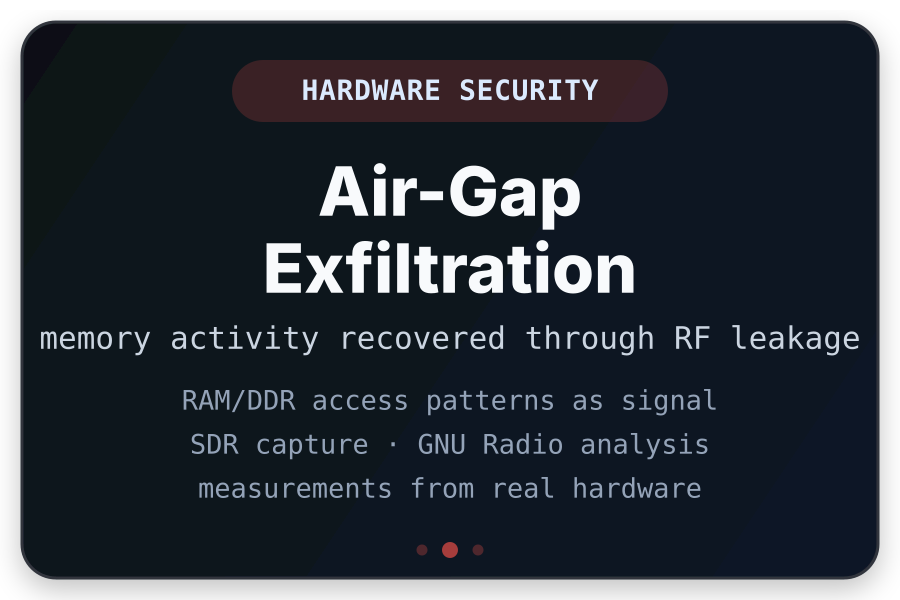
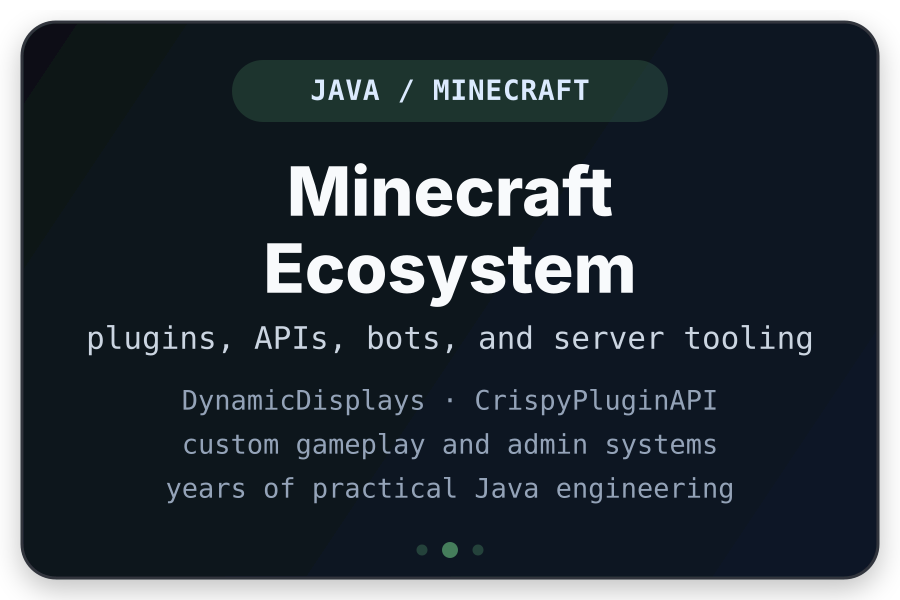

  

<picture>
  <source media="(prefers-color-scheme: dark)" srcset="https://raw.githubusercontent.com/ACrispyCookie/ACrispyCookie/output/github-snake-dark.svg" />
  <source media="(prefers-color-scheme: light)" srcset="https://raw.githubusercontent.com/ACrispyCookie/ACrispyCookie/output/github-snake.svg" />
  
</picture>

## About me

  

[website](https://acrispycookie.dev/) · [linkedin](https://www.linkedin.com/in/jason-nikas-b64163255) · [email](mailto:nikasjason1@gmail.com) · [repositories](https://github.com/ACrispyCookie?tab=repositories)

I started programming through **Java** and **Spigot**, mostly because I wanted to build my own [Minecraft plugins](https://acrispycookie.dev/) instead of only using what already existed. I fell in love with that process almost immediately. Taking an idea, turning it into a working system, and then digging deeper to understand how every piece behaved. After around five years of plugin work, server tooling, APIs, and gameplay systems, that curiosity had grown into a real passion for exploring systems, which I carried into my Electrical & Computer Engineering studies at the **University of Thessaly**, initially expecting to follow mostly the software side of the field.

That changed quickly once I took the more hardware related courses. Digital design lab, computer architecture, and FPGA development made the lower layers feel just as interesting as the software field. Since then, I have liked exploring systems from top to bottom. How code runs, how hardware executes it, and how the layers in between shape behavior.

Outside coursework, I became interested in infrastructure and networks, which led me to build my own **homelab**. It gives me a place to try new technologies properly through deploying services, wiring automation together, experimenting with networking setups, and learning from the details that only show up when something is actually running.

I have also explored security from multiple angles, including hardware security and wireless communications projects (and even when homelabbing to some extent), while continuing to work on graphics and interactive systems through Minecraft, OpenGL, visual demos, and simulation work. More recently, low-level software and HPC pulled me toward GPU programming, CUDA optimization, and a larger collaborative project: building our own GPGPU around RISC-V cores with software support.

**Currently working on:**
- **[GPGPU](https://github.com/ACrispyCookie/GPGPU)** — RISC-V-core GPGPU with software support.
- **Homelab** — self-hosted infrastructure, automation, and networking experiments.

## Selected work

<table>
<tr>
<td width="50%" align="center"></td>
<td width="50%" align="center"></td>
</tr>
<tr>
<td width="50%" align="center"></td>
<td width="50%" align="center"></td>
</tr>
<tr>
<td width="50%" align="center"></td>
<td width="50%" align="center"></td>
</tr>
<tr>
<td width="50%" align="center"></td>
<td width="50%" align="center"></td>
</tr>
</table>

## Project constellation

| Area | Repositories / work |
| --- | --- |
| **Computer Architecture** | [GPGPU](https://github.com/ACrispyCookie/GPGPU), [ECE494 Microprocessor Design](https://github.com/ACrispyCookie/ECE494-Microprocessor-Design) |
| **HPC / CUDA** | [ECE415 High-Performance Computing](https://github.com/ACrispyCookie/ECE415-High-Performance-Computing) |
| **Distributed + OS** | [ECE348 Distributed Systems](https://github.com/ACrispyCookie/ECE348-Distributed-Systems), [ECE318 Operating Systems](https://github.com/ACrispyCookie/ECE318-Operating-Systems), [ECE321 Concurrent Programming](https://github.com/ACrispyCookie/ECE321-Concurrent-Programming) |
| **FPGA / embedded / digital** | [ECE333 Digital Systems Lab](https://github.com/ACrispyCookie/ECE333-Digital-Systems-Lab), [ECE340 Embedded Systems](https://github.com/ACrispyCookie/ECE340-Embedded-Systems), [ECE219 Computer Organization](https://github.com/ACrispyCookie/ECE219-Computer-Organization) |
| **Security + wireless** | [ECE455 Hardware Security](https://github.com/ACrispyCookie/ECE455-Hardware-Security), [ECE436 Wireless Communications](https://github.com/ACrispyCookie/ECE436-Wireless-Communications) |
| **Graphics** | [ECE433 Computer Graphics](https://github.com/ACrispyCookie/ECE433-Computer-Graphics) |
| **Minecraft / Java tooling** | [DynamicDisplays](https://github.com/ACrispyCookie/DynamicDisplays), [CrispyPluginAPI](https://github.com/ACrispyCookie/CrispyPluginAPI), [CrispyCommons](https://github.com/ACrispyCookie/CrispyCommons), [ColonyModeration](https://github.com/ACrispyCookie/ColonyModeration), [ColonySkyblockCore](https://github.com/ACrispyCookie/ColonySkyblockCore), [ColonyHubCore](https://github.com/ACrispyCookie/ColonyHubCore), [ColonyVikingItems](https://github.com/ACrispyCookie/ColonyVikingItems), and many more [minecraft projects](https://acrispycookie.dev) |
| **General tooling** | [KoukBot](https://github.com/ACrispyCookie/KoukBot), [AutoRapidTest](https://github.com/ACrispyCookie/AutoRapidTest), [GoWin-Docker-Image](https://github.com/ACrispyCookie/GoWin-Docker-Image), [dotfiles](https://github.com/ACrispyCookie/dotfiles) |

## Technologies and activity

  

  

  
  
  
  
  

  
  
  
  
  

  
  
  
  
  

  
  
  
  

  

